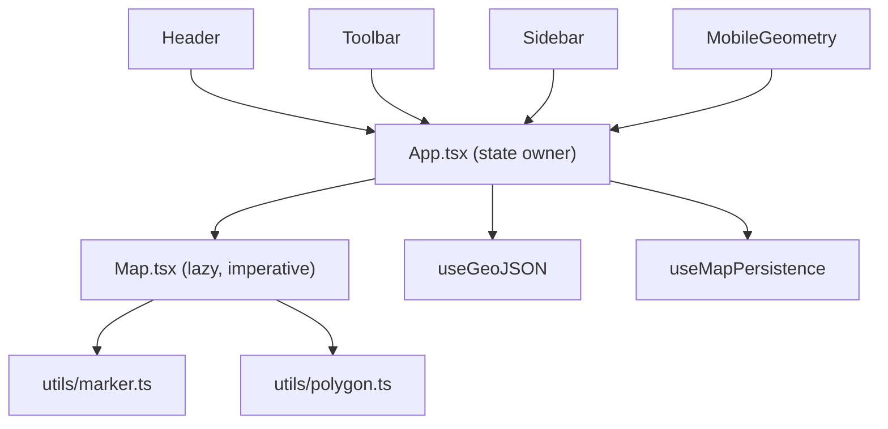

# GeoMap [Preview](https://geomap2911.netlify.app/)

An interactive map editor for placing markers and drawing polygons, with GeoJSON import/export and local persistence. Built with React 19, TypeScript, Vite, Tailwind CSS, and Mapbox GL JS.

---

## Features

- **Marker mode** — click the map to drop markers; each shows its exact coordinates in a popup and in the geometry panel.
- **Polygon mode** — click to add vertices. A live preview line is drawn while you place points, and the shape closes into a filled polygon once it has 3+ vertices. The area is calculated automatically (in km²) using Turf.
- **GeoJSON import/export** — export the current markers and polygon as a standard `FeatureCollection`, or import an existing `.geojson` / `.json` file.
- **Persistence** — state is saved to `localStorage`. Manual Save/Load buttons are available, and edits are also auto-saved (debounced) so a refresh doesn't lose your work.
- **Responsive UI** — a floating sidebar on desktop and a collapsible bottom sheet on mobile, plus a responsive header menu.

---

## Tech Stack

| Concern         | Choice                  |
| --------------- | ----------------------- |
| Framework       | React 19                |
| Language        | TypeScript              |
| Build tool      | Vite                    |
| Styling         | Tailwind CSS v4         |
| Map             | Mapbox GL JS            |
| Geospatial math | `@turf/area`            |
| Icons           | `lucide-react`          |
| Notifications   | `sonner`                |
| Tooling         | ESLint, Prettier, Husky |

---

## Prerequisites

- **Node.js** `22.x` (see `[.nvmrc](.nvmrc)`). With nvm: `nvm use`.
- **npm** `>=10`.
- A **Mapbox access token** — create one for free at [account.mapbox.com](https://account.mapbox.com/access-tokens/).

---

## Getting Started

1. **Install dependencies**

```bash
 npm install
```

2. **Configure environment variables**
   Create a `.env.local` file in the project root:
   The app reads this at build time. If the token is missing, the map area renders a clear inline message instead of failing silently.
3. **Start the dev server**

```bash
 npm run dev
```

The app runs on [http://localhost:3000](http://localhost:3000) (strict port).

---

## Available Scripts

| Script                 | Description                                     |
| ---------------------- | ----------------------------------------------- |
| `npm run dev`          | Start the Vite dev server with HMR.             |
| `npm run build`        | Type-check (`tsc -b`) and build for production. |
| `npm run preview`      | Preview the production build locally.           |
| `npm run lint`         | Run ESLint.                                     |
| `npm run lint:fix`     | Run ESLint with autofix.                        |
| `npm run typecheck`    | Type-check without emitting output.             |
| `npm run format`       | Format the codebase with Prettier.              |
| `npm run format:check` | Check formatting without writing changes.       |

A Husky `pre-push` hook runs formatting, lint, and type-check to keep `main` green.

---

## Usage

1. **Pick a mode** in the toolbar — `Marker` or `Polygon`.
2. **Click the map** to add markers or polygon vertices.
3. Open the **Geometry panel** (sidebar on desktop, bottom sheet on mobile) to review markers and the computed polygon area.
4. Use the **header actions**:

- **Save / Load** — persist to or restore from `localStorage`.
- **Export** — download the current state as `geomap.geojson`.
- **Import** — load markers and a polygon from a GeoJSON file (max 5 MB).

5. **Clear** wipes all geometry (with a confirmation prompt).

---

## Project Structure

```
src/
├── App.tsx                  # State owner: markers, polygon points, mode; wires hooks + layout
├── main.tsx                 # React entry point
├── component/
│   ├── Header.tsx           # Top bar: Save/Load/Export/Import (config-driven, responsive)
│   ├── Toolbar.tsx          # Marker/Polygon mode toggles + Clear
│   ├── Sidebar.tsx          # Desktop floating geometry panel shell
│   ├── MobileGeometry.tsx   # Mobile bottom-sheet geometry panel shell
│   ├── GeometryPanel.tsx    # Shared panel body (markers list + polygon + clear)
│   ├── MarkerCard.tsx       # Single marker coordinate card
│   ├── PolygonCard.tsx      # Polygon area display
│   └── Map.tsx              # Mapbox integration (imperative, lazy-loaded)
├── hooks/
│   ├── useGeoJSON.ts        # Import/export GeoJSON with validation
│   └── useMapPersistence.ts # localStorage load/save/clear + debounced auto-save
├── utils/
│   ├── marker.ts            # Incremental marker reconciliation on the map
│   ├── polygon.ts           # Polygon source/layer setup, updates, and area calc
│   └── geojson.ts           # Build a FeatureCollection from app state
├── constants/
│   └── map.ts               # Token, default center/zoom, style
├── types/
│   └── map.ts               # MarkerType and Point types
└── index.css                # Tailwind entry
```

---

## Architecture

State lives entirely in `[App.tsx](src/App.tsx)`. Mapbox is managed imperatively inside `[Map.tsx](src/component/Map.tsx)` via refs and effects, and is lazy-loaded so the heavy `mapbox-gl` bundle stays out of the initial page load.



### Design notes

- **Incremental rendering** — markers are reconciled by `id` (add/update/remove only what changed) rather than being torn down on every state update. The polygon source and layers are created once and refreshed via `setData`.
- **Derived state** — polygon area is computed with `useMemo` in `App`, keeping `Map` focused on rendering.
- **Persistence** — `[useMapPersistence](src/hooks/useMapPersistence.ts)` validates the stored shape before applying it and debounces auto-save.
- **Safety** — imported GeoJSON is validated and size-capped; marker popups use DOM nodes (`textContent`) rather than raw HTML strings.

---

## GeoJSON Format

Exports produce a standard `FeatureCollection`:

- **Markers** → `Point` features with an `id` in `properties`.
- **Polygon** → a single `Polygon` feature (the ring is auto-closed).

On import, `Point` features become markers and the first ring of the first `Polygon` becomes the polygon points. Only a single polygon is supported.
